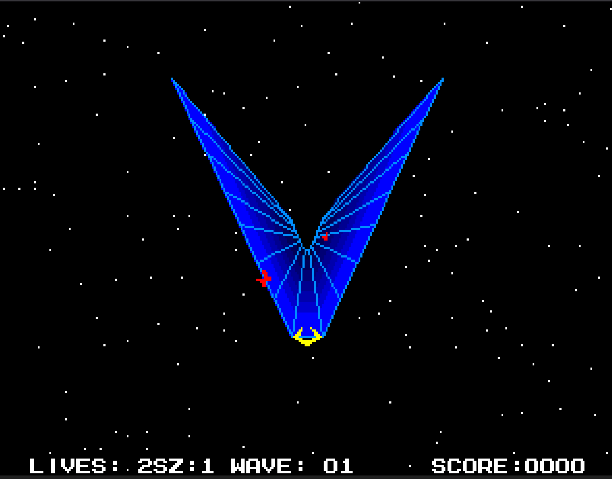

# Tempest 2000 — Sega Mega CD (Mode 1 Cart)

A from-scratch port of Atari Jaguar's **Tempest 2000** (Llamasoft / Atari, 1994) to the **Sega Mega Drive + Mega CD**. Plays as a **Mode 1 cartridge** — code lives on a Mega Drive cart, but uses the Mega CD's Sub CPU, Word RAM, and RF5C164 PCM chip for audio and graphics work the standalone Mega Drive can't do alone.

No CD-ROM disc required. Just a Mega Drive + Mega CD attached.



---

## Why Mode 1 cart?

The Mega CD is best known for FMV games, but its real gift is *hardware*: a second 68000 CPU, 256 KB of shared "Word RAM", a dedicated PCM audio chip, and an ASIC graphics engine. **Mode 1** lets you exploit all of that **without** the CD-ROM constraints — boot from a cartridge, but still call into the Mega CD silicon for anything you can offload.

For a port of Tempest 2000 — a 60 Hz vector-3D shooter with full MOD-tracker music — that turns out to be exactly the architecture you want.

---

## The architecture

```
                         ┌─────────────────────────┐
   ┌────────────┐        │     MEGA DRIVE          │
   │  CART ROM  │◄───────│  Main 68000  ─────►  VDP│   (sprites, planes, web)
   │   ~615 KB  │        │      │                  │
   └────────────┘        └──────┼──────────────────┘
                                │ gate-array comm regs
                                ▼
                         ┌─────────────────────────┐
                         │       MEGA CD           │
                         │  Sub 68000 ────► RF5C164│   (MOD playback + SFX)
                         │      │                  │
                         │      ▼                  │
                         │  PRG RAM (512 KB)       │   MOD data lives here
                         │                         │
                         │  Word RAM (256 KB) ◄───►│   shared with Main
                         │      │                  │
                         │      ▼                  │
                         │  ASIC stamp/map engine  │   wave-transition zoom
                         └─────────────────────────┘
```

**Main CPU (cart)** runs the game loop:

- VDP sprite + tile rendering, plane priority, palette
- Player input, web shape geometry, entity pool, collision
- Wave system, scoring, lives, game state machine
- Drives the Sub CPU via gate-array communication registers

**Sub CPU (Mega CD)** is a dedicated audio + special-effects engine:

- Decodes a 4-channel MOD tracker file and streams samples to the RF5C164
- Plays one-shot PCM SFX (fire / hit / death) on a 5th channel
- Drives the ASIC stamp engine for the wave-transition zoom

**Word RAM** is the shared canvas:

- 16 pre-rasterised "lane variants" of the web (~12.8 KB each), one per player position around the rim. Per-vertex 1/Z perspective baked in.
- Per frame, the variant matching the player's current lane gets DMA'd to VRAM — gives true 3D web parallax at 60 Hz without per-frame software rasterising.

**PRG RAM** holds the active MOD file (one of `rave4 / tune7 / tune5 / tune12` for gameplay, `tune13` for the title screen — all five lifted from the Jag source's tune table).

---

## Game features

- **All 5 core enemies** from the Jaguar original: Flipper, Tanker (splits into 2 flippers), Pulsar (pulse-gated kill), Fuseball (erratic lane-hopper), Spiker + Spike obstacles
- **Per-wave progression** — 16 waves, each with its own enemy quota and shape, then loops forever with escalating difficulty
- **"WAVE N — GET READY" splash** between waves, freezing the action for ~1.5 s
- **Bonus life every 4 waves** (capped at 9), celebrated with a "1UP!" on the splash
- **Superzapper power-up** — 1 charge per wave; clears every live enemy with a screen-flash + per-kill spark + the Jag's own Crackle PCM
- **Web shape rotation** — 8 shapes from the Jag (V, square, plus, triangle, pentagon, star, W, fan) extracted directly from `yak.s`
- **3-life player loop** → game over → back to title; START pauses
- **Iconic fly-down-tube wave transition** rendered by the Mega CD ASIC
- **MOD music** — separate title theme + 4 gameplay tracks (`rave4`, `tune7`, `tune5`, `tune12`) cycled per wave, matching the Jaguar's own `webtunes[]` set. Music keeps playing continuously through scene transitions.
- **4 PCM SFX** — FIRE, HIT, DEATH, ZAP — all extracted from the Jaguar sample bank

---

## Technical highlights

### Per-vertex 3D web at 60 Hz
The Jag rasterises the web with per-vertex 1/Z perspective every frame on its GPU. We can't do that on the Mega Drive — there's no FPU and tile-rendering 12.8 KB per frame would blow the budget. So instead we **pre-bake every camera angle**: at level install, software-render 16 web variants (one per player lane, each with that lane's perspective shift) into Word RAM. Per frame, DMA the variant matching the player's lane to VRAM. **Result: per-vertex parallax at 60 Hz** with ~7 ms per-frame DMA cost.

### Fly-down-tube transition via the Mega CD ASIC
Between waves the web shrinks to a vanishing point — the iconic T2K transition. We can't scale plane B on the VDP, so we revive the otherwise-dormant Mega CD ASIC stamp engine. At transition start, the current web shape is baked into 5×5 ASIC stamps. The Sub CPU then renders the web into Word RAM via a trace vector with growing scale; the result DMAs to VRAM. About 28 frames of pure ASIC zoom, then the variant pipeline takes back over for the new wave.

### Drifting starfield with plane priority layering
Plane A holds a sparse pseudo-random scatter of single-pixel stars across the full screen. The 4 star tiles are re-DMA'd each frame with the bright pixel shifted by 1, so all stars drift diagonally over a ~1 s cycle. Plane B (web) and sprites both run at priority=1; plane A stars at priority=0 — so the web naturally "floats" in space without painting around the V's exact silhouette.

### Entity pool with field reuse
Every game object — flipper, tanker, pulsar, fuseball, spiker, debris particle, superzapper spark — is one entry in a fixed 32-slot pool. Each new entity type **overloads existing struct fields** with per-type semantics rather than widening the struct. This is a hard-won rule: an earlier session lost ~10 hours to a struct-widening bug that turned out to be a memory-corruption-class issue we couldn't isolate, and never reproduced after reverting.

### ROM size: 16 MB → ~615 KB
The megadev linker script anchors `.data` at `0xFF0000`, which makes objcopy pad the output binary to that offset. We trim back to `_rom_end` (read from the sym file) after the build — cart binary down from a default 16 MB to actually-used ~615 KB (most of which is the 5 MOD files).

### Color fidelity
The web uses an 8-step pure-blue gradient across CRAM slots 5-8 + 12-15 (every valid `xBGR` blue intensity from `0x2` to `0xE`), with the outline at `0x0E80` to match the Jag's electric-blue rim. The player claw still uses yellow on slot 11.

### Original font
On-screen text (HUD, LOADING, GAME OVER, scene messages) renders in the Jaguar T2K "small regular font" (`cfont` per `yak.s:19163`). We extract it from `tempest2k-source/src/dat/cfont.dat` + `images/beasty3.cry`, threshold the CRY16 Y-channel at `0x80` (keeps just the bright letter core, drops the anti-alias halo), and emit a raw 4bpp 96-glyph tile blob the megadev DMA helper uploads to VRAM at boot.

---

## Build

```sh
./build.sh            # docker-wrapped megadev toolchain;
                      # outputs ../megacd-port.bin (~615 KB)
```

Sub CPU module (`sub/spx.smd`) builds first, then the cart links the sub binary in via `.incbin`.

## Run

Load `megacd-port.bin` in an emulator that supports Mega CD Mode 1 cart booting. **[ares](https://ares-emu.net/)** is recommended — accurate Sub CPU + Word RAM + ASIC. BlastEm has known quirks with Mode 1 Sub-CPU WR ownership.

```
ares megacd-port.bin
```

On real hardware: flash to a flashcart that supports Mode 1, attach to a Mega CD, boot.

## Controls

| Button | Title | Playfield | Game over |
|--------|-------|-----------|-----------|
| **D-pad ◀ ▶** | — | walk lanes | — |
| **A** | — | fire | — |
| **B** | — | superzapper (1 charge per wave) | — |
| **C** | cycle preview shape | (debug) force wave transition | — |
| **START** | begin play | **pause / resume** | back to title |

---

## Credits + sources

- **Original game**: Tempest 2000 — Llamasoft / Atari, Jaguar (1994), by Jeff Minter and team.
- **Reverse-engineered Jag source**: [mwenge/tempest2k](https://github.com/mwenge/tempest2k) — invaluable reference for enemy AI, wave structure, polygon data, and palette decisions.
- **Mega CD development framework**: [megadev](https://github.com/drojaazu/megadev) — provided the Mode 1 boot setup, Sub CPU build pipeline, and VDP helpers.
- **MOD player on RF5C164**: based on the Chilly Willy lineage via [matteusbeus/ModPlayer](https://github.com/matteusbeus/ModPlayer).

---

## License + redistribution

Source code under this project is provided for educational and homebrew purposes. Tempest 2000 itself is © Atari / Llamasoft. The MOD music files (`rave4.mod`, `tune5.mod`, `tune7.mod`, `tune12.mod`, `tune13.mod`), the on-screen font tiles, and the polygon/sprite data are all derived from the original game; redistribution beyond personal use should respect the rights of the original creators.
